# Liberty getting started application
This is a modified version of the code for [Getting started tutorial for Liberty](https://console.bluemix.net/docs/runtimes/liberty/getting-started.html#getting-started-tutorial) for use in IBM Cloud Private developer training.

The main difference with this version is that it does not use an external IBM Cloudant service but rather uses a containerized version of Apache Derby database. 

This app adheres to best practices of the [12-Factor app](https://12factor.net/). A detailed checklist can be found [here](12-factor.md).

<p align="center">
  <kbd>
    
  </kbd>
</p>

The following steps are the general procedure to set up and deploy your app to IBM Cloud. See more detailed instructions in the [Getting started tutorial for Liberty](https://console.bluemix.net/docs/runtimes/liberty/getting-started.html#getting-started-tutorial).

## Forking the repository

1. Go to the repository located at https://github.com/odrodrig/get-started-java-icp

2. Sign into GitHub if you haven't already

3. Click on the **Fork** button at the top right of the page

4. Be sure to copy the URL to this newly forked project.

This will create a copy of the application in your GitHub account for you to be able to modify

## Accessing the IBM Cloud demo instance

For this lab, we will be borrowing from an existing tutorial from the IBM Cloud Garage. The tutorial and many like it can be found at https://www.ibm.com/cloud/garage/dte/tutorial/set-jenkins-pipeline-continuously-integrate-and-deliver-kubernetes-deployments-ibm-cloud?task=3.

1. Go to [this IBM Cloud Garage tutorial](https://www.ibm.com/cloud/garage/dte/tutorial/set-jenkins-pipeline-continuously-integrate-and-deliver-kubernetes-deployments-ibm-cloud?task=3) 

2. On the right side of that page you should see a section that is titled *Before you start*. Click on the *log in* link and log in with your IBM ID if you haven't already.

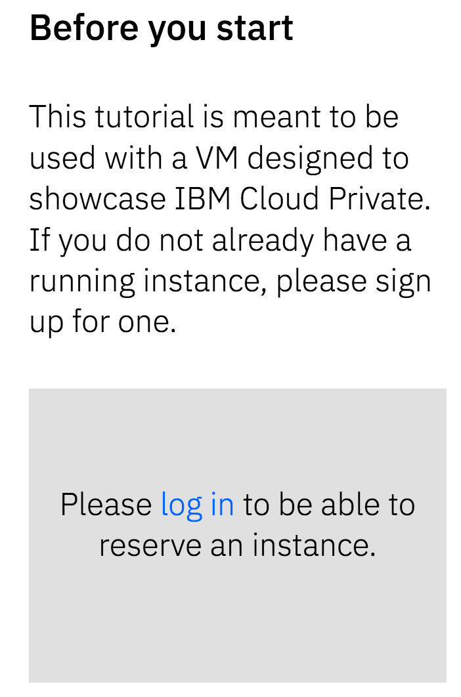

3. Fill out the information that the form is asking for and once you agree to the terms of use, then click on **Reserve instance**.

2. You should get an email with a link to the environment and a password to sign in with.

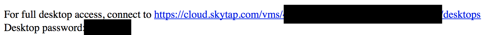

3. Next, copy the **Desktop password** from the email and click on the link.

4. Enter your password to access the demo

   Be sure to take out any spaces you may have copied with the password. If you are getting an invalid password error, paste what you have copied into a text document and verify that there are no spaces in the password that you copied.

5. You should then see two VMs. Click on the play button above the **Master** VM.

   It will take a few minutes for the VMs to start. After they are started, click on **ICPMasater**.

   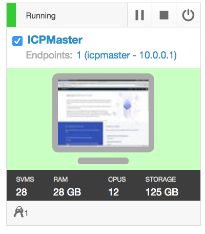

   Be sure to resize your window using the VM controls to make navigation within the VM comfortable. 

5. Once you can see the VM's desktop, open up the terminal by either double clicking the icon on the desktop or by clicking on the blue button at the top left of taskbar and selecting **terminal emulator**.


Our first task within the VM will be to authenticate the *cloudctl* cli tool with the IBM Cloud Private cluster which will configure the *kubectl* and *helm* cli tools as well.

7. CD into your **~/Documents/** directory and clone the GitHub project that you forked earlier. You can find this by navigating to the repository in your browser and clicking on the green **Clone or Download** button on the right side of the page.

To clone the repo use the following comand replacing **\<url to repo\>** with the url that you copied.

```bash
git clone <url to repo>
```

7. Next, change directory in the repository that was cloned and find the **/setup/** directory.

8. From the **/setup/** directory run the following command:

```bash
bash setup.sh
```

This setup script will install the IBM Cloud Private plugin for the command line and configure it to point to the cluster within ICP. This also properly configures helm to work with ICP.


## Deploying the Helm chart of the application

Before we install the Helm chart, we need to add an image policy to IBM Cloud Private that will allow us to pull public Docker images from Docker Hub. 

1. Open the Firefox browser and click on the **IBM Cloud Private** bookmark in the bookmark bar just under the address bar.


2. Log into ICP using **admin** as the username and password.

1. Then, click on the menu button at the top left and click on **Manage** and then **Resource Security**.

  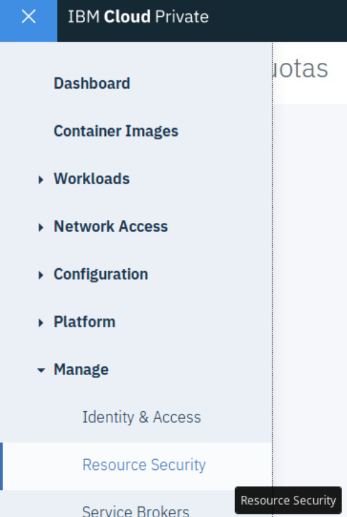

2. Then, click on the button on the left side of the page that says **Image Policies**

  

3. Click on the blue **Create Image Policy** on the right side of the page.

4. Enter the following information in their respective fields:
  - Name: docker
  - Scope: Namespace
  - Namespace: default

  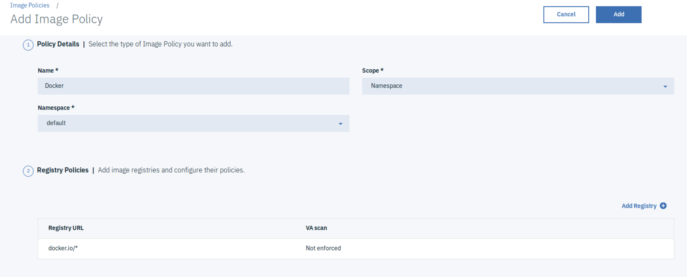

  Then click on **Add Registry** and for *Registry URL* enter the following:

  ```
  docker.io/*
  ```

  Next, ensure that *VA scan policy* is set to **Do not enforce**

  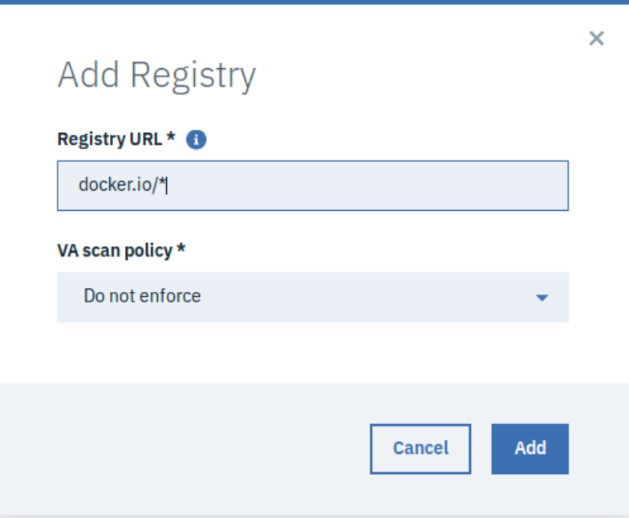

  5. Click **Add**
  6. Click **Add** at the top right to finalize the Image Policy.

With our new Image Policy set up, we can now deploy public images from Docker Hub to ICP.

6. Open up your terminal again

7. CD into the **/chart/liberty-starter/** directory of this repository and run the following command:

```bash
helm install . --tls --name liberty-starter
```

This will deploy the java application as well as a derby database within the kubernetes cluster.

Since this instance of ICP is running inside of a VM, we can't access our application outside of that VM. If you'd like to view the app you just deployed, do the following: 

1. From ICP, click on the menu button at the top left and click on *Workloads* then *Deployments*.
2. On the deployments page, look for the **liberty-starter-web** deployment and click on it.
3. Then, click on the blue *launch* button at the top right of the page.
4. A new tab should open up in your browser that will take you to the running app.
5. In the app, you can enter a name and it will be saved in the derby database. If you refresh the page, you will see the contents of the database under the textbox.

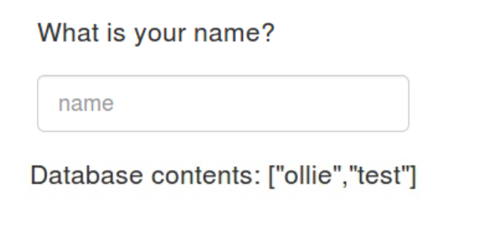

## Creating a CI/CD pipeline

In this section we will be connecting our cloned GitRepo to a Continuous Integration/Continuous Deployment pipeline built with Jenkins. This pipeline contains 4 different steps as follows:

  | Stage                         | Purpose                                                                        |
  | ----------------------------- | ------------------------------------------------------------------------------ |
  | Build Application War File    | Pulls in dependencies from Maven and packages application into .war file       |
  | Build Docker Image            | Builds the Docker image based on the Dockerfile                                |
  | Push Docker Image to Registry | Uploads the Docker image to the Docker image registry withinin ICP             |
  | Deploy New Docker Image       | Updates the image tag in the Kubernetes deployment triggering a rolling update |

 More details of this pipline can be found in [JenkinsfileLab](./JenkinsfileLab).

 1. Jenkins is already installed in this instance of IBM Cloud Private. To access it, open the Firefox browser and click on the **Most Visited** entry from the bookmark bar and select **Dashboard[Jenkins]**.

 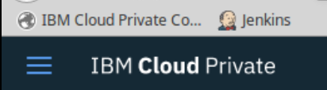

 2. Log into Jenkins. The username and password should be autofilled for you. If not, the username should be "admin" and the password is stored in a kubernetes secret. To view the secret, run the following command in the terminal:

 ```bash
 printf $(kubectl get secret --namespace default jenkins -o jsonpath="{.data.jenkins-admin-password}" | base64 --decode);echo
 ```

3. Click on **New Item**, enter "liberty_starter_pipeline" for the name, and select **Pipeline**. When done, click **ok**.

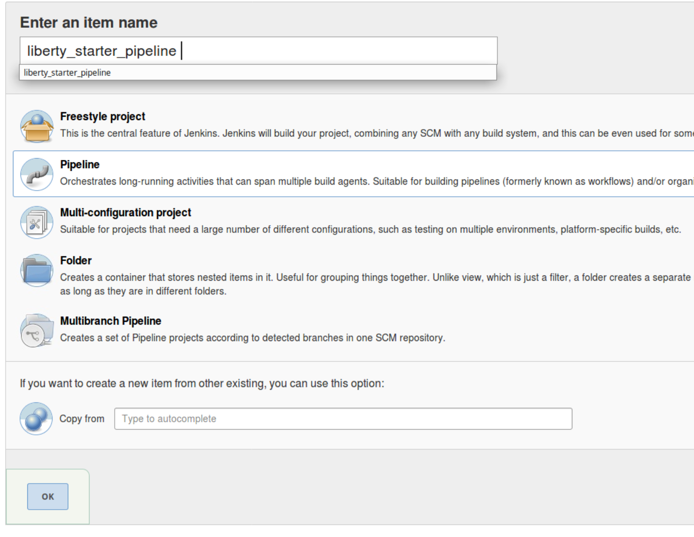

4. Find and click on the **Configure** button on the left side of the page.

5. Scroll down to the **Pipeline** section and find the **definition** drop down menu. Select **Pipeline script from SCM** and for **SCM** select **Git**.

6. For **Repository URL** enter the url to the cloned repository that you forked earlier. Ensure the **/master** branch is being targeted and click **Save**.


Now with our pipeline configured we can make a change and deploy the new version.

7. On your local machine, clone the repo that you forked before. To clone the repo use the following comand replacing **\<url to repo\>** with the url that you copied.

```bash
git clone <url to repo>
```

8. Open the application in a code editor or IDE of your choice. For this lab we will be making a change to the index.html page to change the display language.

9. Open **/src/main/webapp/index.html** and on line 2 locate the **\<html lang="es">** tag.

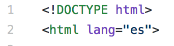

10. Change the **"en"** to one of the following:

- en: English
- es: Spanish
- pt: Portuguese
- fr: French
- ja: Japanese

This will change the language that loads on the webpage to whatever language you selected.

11. Save the file and push to github.

Since this instance of ICP is for demos, it can't be accessed by github which makes automatic deployments not possible on code commits but we can manually trigger pipeline builds.

12. Swich back to ICP and open the pipeline that was created earlier.

13. Click on the **Build now** button to manually start the build process. This will pull the latest code from your code repository on GitHub.


14. Your pipeline will now start building. You should see the different stages appear on the pipeline page.

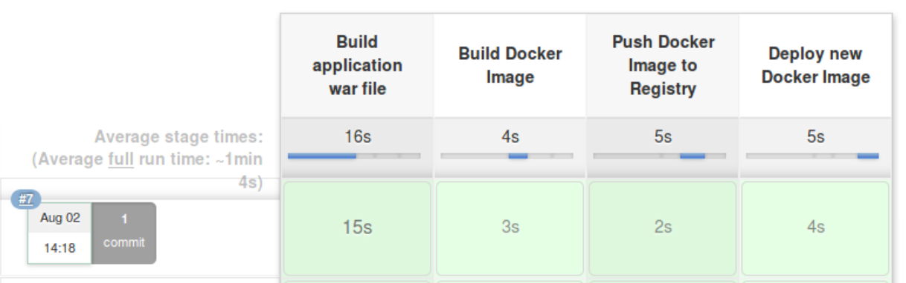

15. When the pipeline is finish deploying, open up the app by going to the address that we found earlier and you can see that the language of the page has been changed.


