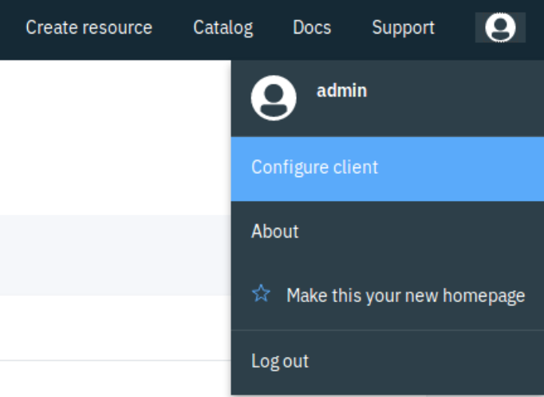
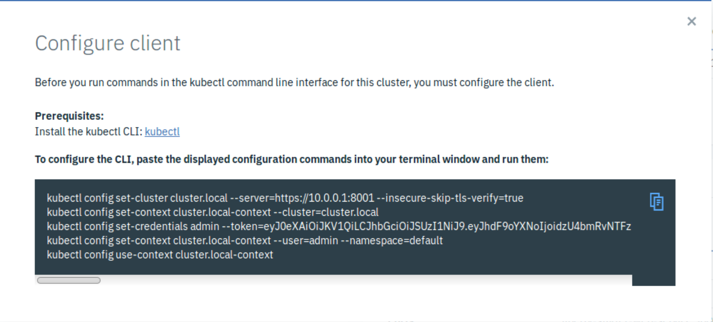
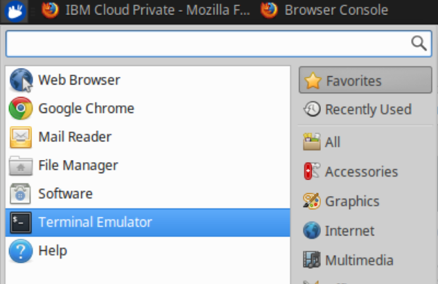
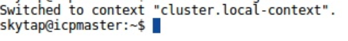
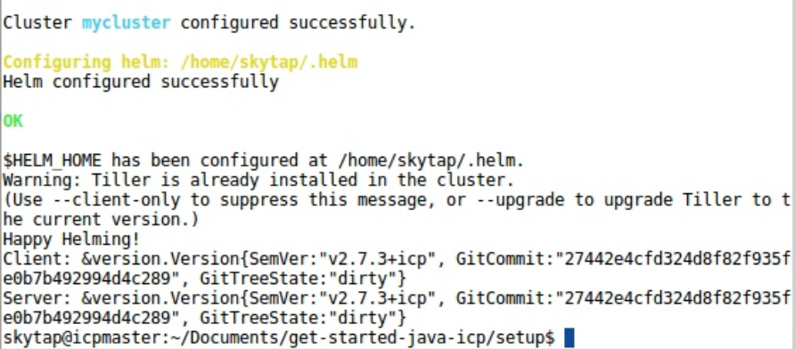

# Environment Setup

1. Once logged into your IBM Cloud Private virtual environment, click on the profile icon at the top right of the dashboard and select **Configure client**.



2. Copy all the lines or just click on the double page icon to copy all lines to the clipboard.



3. Then, open up the terminal by either double clicking the icon on the desktop or by clicking on the blue button at the top left of taskbar and selecting **terminal emulator**.



4. Paste in the lines that were copied in the previous step.



You should see **Switched to context "cluster.local-context"** when done.

5. Next, change directory in the repository that was cloned and find the **/setup/** directory.

6. From the **/setup/** directory run the following command:

```bash
bash setup.sh
```

This setup script will authenticate the 'cloudctl' tool with your instance of ICP and configure it to point to the cluster within ICP. This also properly configures helm to work with ICP.

